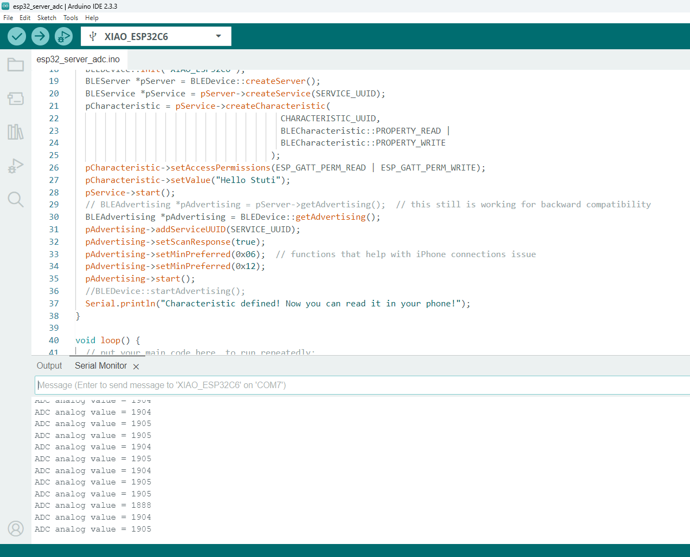
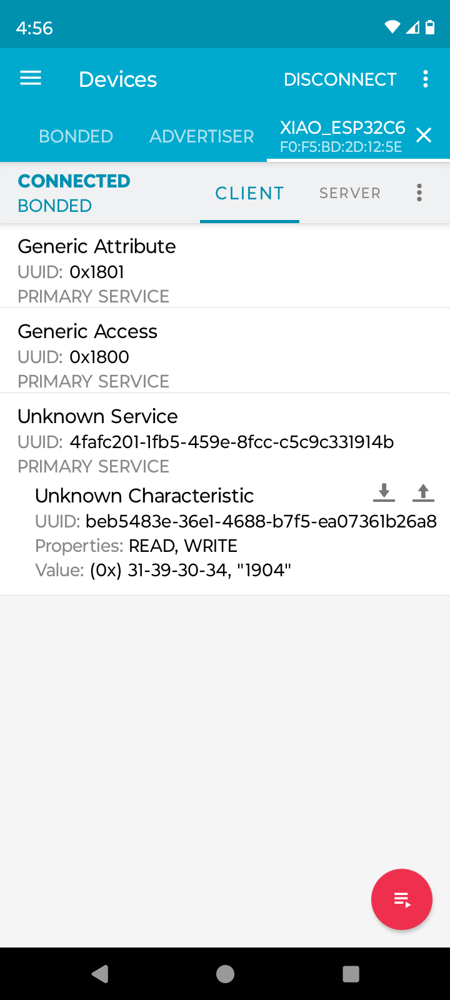

# README for esp32_server_adc.ino
This project demonstrates a BLE (Bluetooth Low Energy) server application on the ESP32-C6 that reads analog data from a sensor connected to the `A0` pin and broadcasts 
the data to the connected BLE client (mobile phone). The server updates the BLE characteristic every 2 seconds, allowing connected device to retrieve the real-time 
analog value.

## Features
- Uses BLE to broadcast sensor data.
- Reads analog data from pin `A0` with a 12-bit resolution.
- Uses `nRF Connect` for viewing BLE data on mobile.

## Requirements
- **Hardware**: ESP32-C6 board
- **Software**: 
  - Arduino IDE with ESP32 board support
  - ESP32 BLE library (compatible with ESP32-C6)

## Setup Instructions
1. **Setting up ESP32 board option in the Arduino IDE** 
   - Open Preferences: Go to "File > Preferences" in the Arduino IDE. 
   - Add Board Manager URL: In the "Additional Board Manager URLs" field, paste the ESP32 URL 
     (usually "https://espressif.github.io/arduino-esp32/package_esp32_index.json"). 
   - Open Boards Manager: Navigate to "Tools > Board > Boards Manager". 
   - Install ESP32: Search for "ESP32" and click "Install" for the "ESP32 by Espressif Systems" option. 

2. **Open in Arduino IDE**
   - Open the `esp32_server_adc.ino` file in Arduino IDE.

3. **Upload the Code**
   - Connect your ESP32-C6 board via USB.
   - Click on the upload button to flash the code to the board.

## Code Overview
- **UUID Definitions**: Unique identifiers are used for the BLE service and characteristic.
- **Analog Pin**: Reads data from `A0` and sends it over BLE.
- **BLE Setup**:
  - Initializes BLE with the device name "XIAO_ESP32C6".
  - Creates a BLE server and starts a service with read and write properties.
  - The characteristic is updated with the analog sensor data every 2 seconds.

## BLE Structure

| Parameter      | Value                                    |
|----------------|------------------------------------------|
| **Service UUID**        | `4fafc201-1fb5-459e-8fcc-c5c9c331914b` |
| **Characteristic UUID** | `beb5483e-36e1-4688-b7f5-ea07361b26a8` |

For specific details, please refer to inline comments.

## Usage
1. After flashing, the ESP32-C6 will begin advertising.
2. Use the nRF Connect app to scan for devices.
3. Connect to `XIAO_ESP32C6`.
4. Read the characteristic value to view the analog data.

## Example Output
On connection, the BLE client will receive the analog values every 2 seconds. 
Sample output on the serial monitor:

Sample output on the nRF Connect app:

## Troubleshooting
- Ensure the ESP32-C6 board is selected and it is connected to the correct COM port.
- Check that the correct libraries have been installed in Arduino IDE.
